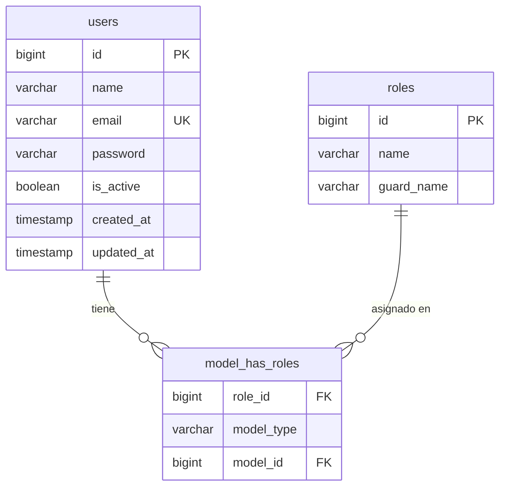
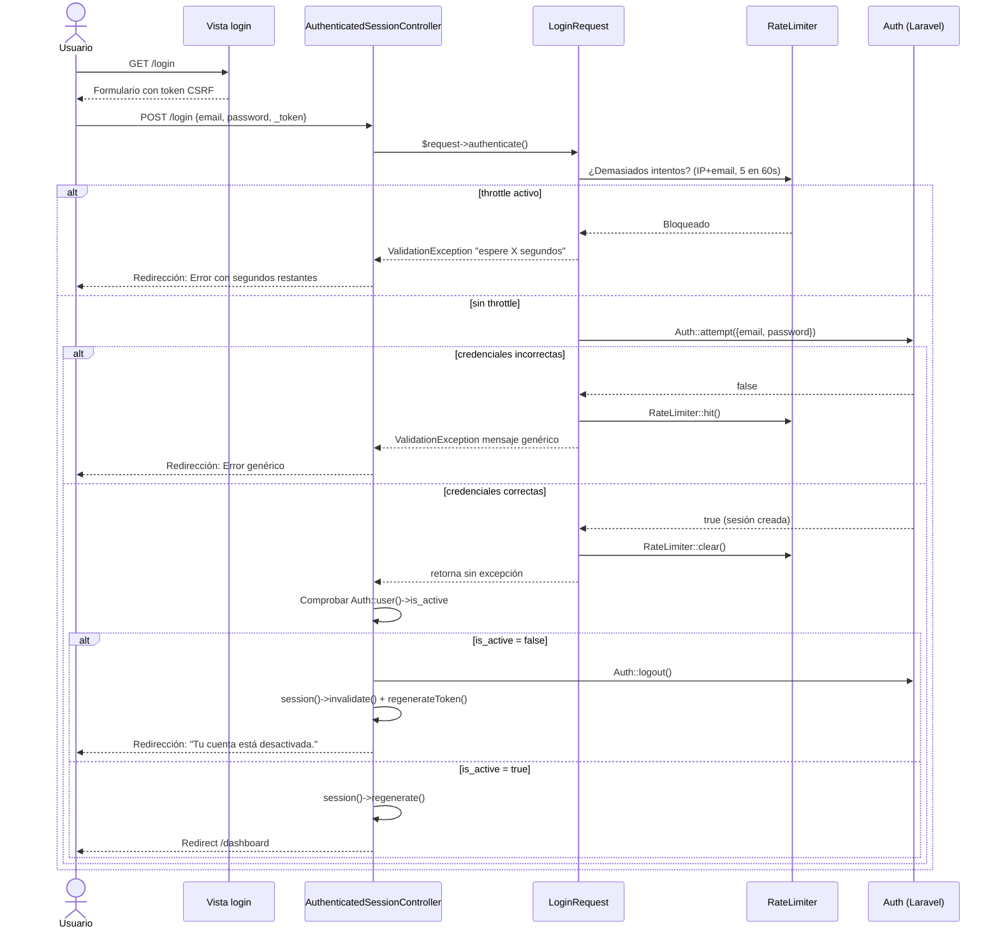
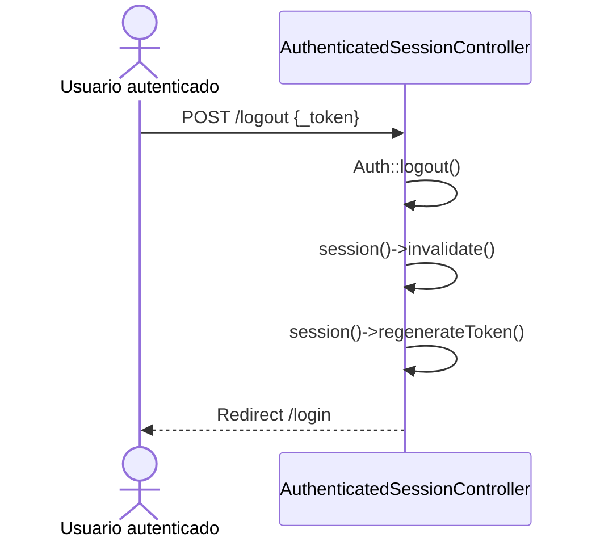

# Design Document — Authentication

## Overview

Este módulo implementa la autenticación, gestión de usuarios y control de acceso por roles para LiveSales. Cubre el login/logout de usuarios internos, la protección de rutas, la administración de usuarios por parte del Administrador, la asignación de roles y el seed inicial del sistema.

No existen cuentas públicas para clientes. Todos los usuarios son personal interno del negocio.

**Decisiones de diseño principales:**

- **Autenticación nativa de Laravel 12**: `Auth` facade, sesiones, middleware `auth`, `RateLimiter`, y controladores propios escritos desde cero. No se utiliza ningún starter kit externo (Breeze, Jetstream u otro). Las vistas usan Blade con Bootstrap.
- **Spatie Laravel Permission v6** para gestión de roles (`Administrador`, `Vendedor`). Se integra directamente sobre el modelo `User` mediante el trait `HasRoles`.
- **Campo `is_active`** en la tabla `users` para activación/desactivación sin eliminación física. Un middleware personalizado (`EnsureUserIsActive`) comprueba este campo en cada solicitud autenticada.
- **Rate limiting** de login mediante `RateLimiter` de Laravel: máximo 5 intentos fallidos por combinación IP+email en 60 segundos.
- **Form Requests** para todas las operaciones de escritura sobre usuarios.
- **Concurrencia en protección del último Administrador**: las operaciones de desactivación y cambio de rol que afecten a un Administrador se ejecutan dentro de una transacción con bloqueo pesimista (`lockForUpdate`) para evitar condiciones de carrera. La lógica se extrae a `DeactivateUserAction` cuando corresponde.
- **Configuración del Administrador inicial** a través de un archivo de configuración propio (`config/livesales.php`) que expone las variables de entorno `ADMIN_NAME`, `ADMIN_EMAIL` y `ADMIN_PASSWORD`. Los seeders acceden a estos valores únicamente mediante `config()`, nunca mediante llamadas directas a `env()`.

---

## Architecture

El módulo sigue la arquitectura MVC estándar de Laravel sin capas adicionales, salvo una Action para la operación de desactivación que involucra concurrencia.

```
Browser
  │
  ├── GET/POST /login           → AuthenticatedSessionController (propio)
  ├── POST /logout              → AuthenticatedSessionController (propio)
  │
  └── /users/*                 → UserController
          │
          ├── middleware: auth
          ├── middleware: 'active' (EnsureUserIsActive)
          └── middleware: role:Administrador   (Spatie)
```

**Flujo de una solicitud autenticada:**

```
Request
  → bootstrap/app.php: auth (RedirectIfAuthenticated / Authenticate)
  → middleware 'active' (EnsureUserIsActive)
  → [Para /users/*] Spatie role check (Administrador)
  → Controller
  → Response
```

> En Laravel 12 no existe `app/Http/Kernel.php`. El registro de middlewares se realiza en `bootstrap/app.php` mediante el objeto `$middleware` que expone `appendToGroup()`, `alias()` y otros métodos.

---

## Components and Interfaces

### Controladores

#### `App\Http\Controllers\Auth\AuthenticatedSessionController`
Controlador propio (escrito desde cero). Maneja login y logout.

- `create()` — muestra el formulario de login
- `store(LoginRequest $request)` — llama a `$request->authenticate()` una única vez — toda la lógica de throttle y el intento de autenticación ocurre dentro de `LoginRequest`. Si `authenticate()` retorna sin excepción, la sesión ya está abierta; comprueba inmediatamente `Auth::user()->is_active`: si es `false`, ejecuta `Auth::logout()` + `session()->invalidate()` + `session()->regenerateToken()` y retorna el error "Tu cuenta está desactivada."; si es `true`, llama `$request->session()->regenerate()` y redirige al dashboard. Si `authenticate()` lanza `ValidationException`, Laravel lo maneja automáticamente y redirige al formulario con errores.
- `destroy(Request $request)` — invalida la sesión y regenera el token

#### `App\Http\Controllers\UserController`
Gestión de usuarios internos. Solo accesible para el rol Administrador.

- `index()` — lista de usuarios paginada (25 por página)
- `create()` — formulario de creación
- `store(StoreUserRequest $request)` — crea usuario y asigna rol dentro de `DB::transaction()` para garantizar atomicidad
- `edit(User $user)` — formulario de edición
- `update(UpdateUserRequest $request, User $user)` — actualiza nombre, email, contraseña opcional y rol; aplica protección del último Administrador activo cuando el rol cambia de `Administrador` a `Vendedor`
- `activate(User $user)` — activa usuario inactivo
- `deactivate(User $user)` — desactiva usuario activo (delegado a `DeactivateUserAction`)

### Actions

#### `App\Actions\Users\DeactivateUserAction`
Encapsula la lógica de desactivación de un usuario Administrador con transacción y bloqueo pesimista. Se utiliza desde `UserController::deactivate()`. Ver detalles en la sección de concurrencia (Flujo 7).

### Middleware

#### `App\Http\Middleware\EnsureUserIsActive`
Se ejecuta en cada solicitud autenticada entrante. Si `auth()->user()->is_active === false`, invalida la sesión, cierra al usuario y redirige al login con mensaje de error.

```php
// Lógica resumida
public function handle(Request $request, Closure $next): Response
{
    if (Auth::check() && ! Auth::user()->is_active) {
        Auth::logout();
        $request->session()->invalidate();
        $request->session()->regenerateToken();
        return redirect()->route('login')
            ->withErrors(['email' => 'Tu cuenta está desactivada.']);
    }
    return $next($request);
}
```

```php
// bootstrap/app.php
->withMiddleware(function (Middleware $middleware) {
    $middleware->alias([
        'active' => \App\Http\Middleware\EnsureUserIsActive::class,
        'role'   => \Spatie\Permission\Middleware\RoleMiddleware::class,
    ]);
})
```

> `EnsureUserIsActive` se registra como alias `'active'` para usarse explícitamente solo en las rutas internas que lo requieren, sin ejecutarse en las rutas públicas (`/login`). El alias `'role'` registra el middleware de Spatie Laravel Permission; el nombre de clase exacto puede variar según la versión que instale Composer, pero el alias `'role'` permanece estable en las rutas. Ambos alias se declaran en `bootstrap/app.php` porque Laravel 12 no tiene `app/Http/Kernel.php`.

### Form Requests

#### `App\Http\Requests\Auth\LoginRequest`
Form Request propio. Valida `email` (required, email format) y `password` (required, string). Contiene el método `authenticate()` que centraliza toda la lógica de throttle y autenticación:
- Comprueba el rate limit antes de intentar la autenticación (clave: `sha1($email.'|'.$ip)`, máximo 5 intentos en 60 segundos).
- Ejecuta `Auth::attempt(['email' => ..., 'password' => ...])` usando únicamente email y password (sin incluir `is_active` en las credenciales).
- Si el intento falla: incrementa `RateLimiter::hit()` y lanza `ValidationException` con mensaje genérico sin indicar qué campo es incorrecto.
- Si el intento tiene éxito: limpia el contador con `RateLimiter::clear()` y retorna (la sesión quedó abierta por `Auth::attempt()`).

#### `App\Http\Requests\StoreUserRequest`
- `name`: required, string, max:255
- `email`: required, email, max:255, unique:users
- `password`: required, string, min:8, max:255, confirmed
- `role`: required, in:Administrador,Vendedor

#### `App\Http\Requests\UpdateUserRequest`
- `name`: required, string, max:255
- `email`: required, email, max:255, `unique:users,email,{id}` (ignorar el propio usuario)
- `password`: nullable, string, min:8, max:255, confirmed
- `role`: required, in:Administrador,Vendedor

### Modelo

#### `App\Models\User`
```php
// Traits agregados
use HasRoles; // Spatie

// Fillable
protected $fillable = ['name', 'email', 'password', 'is_active'];

// Casts
protected function casts(): array
{
    return [
        'password'  => 'hashed',
        'is_active' => 'boolean',
    ];
}

// is_active por defecto: true
protected $attributes = [
    'is_active' => true,
];
```

### Vistas

Todas las vistas usan el sistema de layouts de Blade con Bootstrap.

```
resources/views/
├── layouts/
│   ├── app.blade.php          (layout principal con sidebar/nav para usuarios autenticados)
│   └── guest.blade.php        (layout limpio para login)
├── auth/
│   └── login.blade.php        (formulario de login con Bootstrap)
└── users/
    ├── index.blade.php        (lista de usuarios paginada)
    ├── create.blade.php       (formulario de creación)
    └── edit.blade.php         (formulario de edición)
```

> **Bootstrap vía Vite (no CDN):** Bootstrap 5 se instala mediante npm (`bootstrap` y `@popperjs/core`) e importado a través de los assets de Laravel (`resources/js/app.js` o `resources/css/app.css`). Los layouts Blade cargan los assets compilados con las directivas `@vite`. No se utiliza CDN. El paginador de Laravel se configura para Bootstrap 5 mediante `Paginator::useBootstrapFive()` en `AppServiceProvider::boot()`, de forma que `{{ $users->links() }}` genera HTML compatible con Bootstrap.

### Seeders

#### `Database\Seeders\RolesAndPermissionsSeeder`
Crea los roles `Administrador` y `Vendedor` usando `firstOrCreate` para ser idempotente.

#### `Database\Seeders\AdminUserSeeder`
Lee las credenciales del administrador inicial usando `config('livesales.admin_name')`, `config('livesales.admin_email')` y `config('livesales.admin_password')`. Estos valores se exponen a través del archivo de configuración `config/livesales.php`, que a su vez los lee de las variables de entorno `ADMIN_NAME`, `ADMIN_EMAIL` y `ADMIN_PASSWORD`. Lanza una excepción descriptiva si alguna variable no está definida. Crea el usuario administrador inicial usando `firstOrCreate` sobre el email.

> Nunca se llama a `env()` directamente en los seeders. Toda lectura de configuración pasa por `config()`.

> Durante la implementación debe crearse `config/livesales.php` y añadir `ADMIN_NAME`, `ADMIN_EMAIL` y `ADMIN_PASSWORD` a `.env.example`.

#### `Database\Seeders\DatabaseSeeder`
Orquesta la ejecución en orden: `RolesAndPermissionsSeeder` → `AdminUserSeeder`.

---

## Data Models

### Tabla `users` (migración adicional sobre la existente)

Se agrega el campo `is_active` a la tabla `users` existente mediante una nueva migración.

```
users
─────────────────────────────────────────────────────
id               BIGINT UNSIGNED  PK, AUTO_INCREMENT
name             VARCHAR(255)     NOT NULL
email            VARCHAR(255)     NOT NULL, UNIQUE INDEX
email_verified_at TIMESTAMP       NULL
password         VARCHAR(255)     NOT NULL
is_active        BOOLEAN          NOT NULL, DEFAULT TRUE, INDEX
remember_token   VARCHAR(100)     NULL
created_at       TIMESTAMP        NULL
updated_at       TIMESTAMP        NULL
```

> `email_verified_at` se mantiene de la migración original de Laravel aunque no se usa activamente en el MVP. No añade complejidad y evita una migración innecesaria para eliminarlo.

### Tablas de Spatie Laravel Permission

Spatie publica y gestiona sus propias migraciones. Las tablas relevantes son:

```
roles
─────────────────────────────────
id           BIGINT UNSIGNED  PK
name         VARCHAR(255)     NOT NULL
guard_name   VARCHAR(255)     NOT NULL
created_at / updated_at

model_has_roles                         (pivote User ↔ Role)
─────────────────────────────────────────
role_id        BIGINT UNSIGNED  FK → roles.id
model_type     VARCHAR(255)     ('App\Models\User')
model_id       BIGINT UNSIGNED  (users.id)
PRIMARY KEY (role_id, model_id, model_type)
```

Spatie también crea `permissions`, `model_has_permissions` y `role_has_permissions`, que en el MVP se utilizan implícitamente a través de los roles.

### Índices y restricciones de BD

| Tabla | Campo | Tipo | Razón |
|-------|-------|------|-------|
| `users` | `email` | UNIQUE | Integridad de correos únicos (capa BD) |
| `users` | `is_active` | INDEX | Consultas frecuentes en el middleware de estado y en las validaciones del último Administrador |
| `model_has_roles` | PK compuesta | PK | Unicidad de la asignación rol↔usuario (gestionada por Spatie) |

### Diagrama de entidades



---

## Routes

```php
// routes/web.php

// Rutas públicas (solo accesibles sin sesión activa)
Route::middleware('guest')->group(function () {
    Route::get('login', [AuthenticatedSessionController::class, 'create'])
         ->name('login');
    Route::post('login', [AuthenticatedSessionController::class, 'store']);
});

// Cierre de sesión (requiere autenticación + CSRF)
Route::post('logout', [AuthenticatedSessionController::class, 'destroy'])
     ->middleware('auth')
     ->name('logout');

// Rutas internas protegidas
Route::middleware(['auth', 'active'])->group(function () {

    // Dashboard principal (accesible para todos los roles)
    Route::get('dashboard', fn() => view('dashboard'))
         ->name('dashboard');

    // Gestión de usuarios (solo Administrador)
    Route::middleware('role:Administrador')->prefix('users')->name('users.')->group(function () {
        Route::get('/',              [UserController::class, 'index'])->name('index');
        Route::get('create',         [UserController::class, 'create'])->name('create');
        Route::post('/',             [UserController::class, 'store'])->name('store');
        Route::get('{user}/edit',    [UserController::class, 'edit'])->name('edit');
        Route::put('{user}',         [UserController::class, 'update'])->name('update');
        Route::patch('{user}/activate',   [UserController::class, 'activate'])->name('activate');
        Route::patch('{user}/deactivate', [UserController::class, 'deactivate'])->name('deactivate');
    });

});
```

**Notas:**
- No se incluyen rutas de registro público.
- No se incluyen rutas de reset de contraseña en el MVP (no están en los requisitos).
- No existe una ruta separada para cambio de rol; el rol se actualiza a través del endpoint `PUT /users/{user}` (método `update`).
- La protección CSRF sigue activa por el middleware `web` de Laravel para todas las rutas del grupo web; no requiere configuración adicional.
- El middleware `role:Administrador` es provisto por Spatie y verifica el rol en servidor antes de ejecutar cualquier acción.

---

## Main Flows

### Flujo 1: Login



> `LoginRequest::authenticate()` centraliza la lógica de throttle, comprueba el rate limit, ejecuta `Auth::attempt()` y limpia o incrementa el contador. `Auth::attempt()` no incluye `is_active` en las credenciales, permitiendo que el controlador distinga entre credenciales incorrectas y usuario inactivo. Si `authenticate()` lanza `ValidationException`, Laravel lo captura y redirige automáticamente al formulario con errores en sesión. Si retorna sin excepción, el controlador comprueba `is_active` y completa el login o lo rechaza.

### Flujo 2: Logout



### Flujo 3: Acceso a ruta protegida sin sesión

```
Request GET /dashboard
  → Middleware auth: sin sesión → redirect /login
```

### Flujo 4: Acceso a ruta de usuarios con rol Vendedor

```
Request GET /users (usuario autenticado con rol Vendedor)
  → Middleware auth: OK
  → Middleware EnsureUserIsActive: OK
  → Middleware role:Administrador: FALLA → 403 Forbidden
```

### Flujo 5: Inactivación de usuario con sesión activa

```
1. Admin desactiva a "María" → users.is_active = false
2. "María" hace cualquier solicitud HTTP
3. Middleware EnsureUserIsActive detecta is_active = false
4. Auth::logout() + session invalidation
5. Redirect /login con mensaje "cuenta desactivada"
```

### Flujo 6: Crear usuario

```
POST /users
  → StoreUserRequest: validar nombre, email único, contraseña, rol
  → UserController::store()
      → DB::transaction():
          → User::create([...])        (is_active = true por defecto)
          → $user->assignRole($request->validated('role'))
      → Commit
  → Redirect /users con mensaje de éxito
```

`store()` envuelve la creación del usuario y la asignación del rol en una transacción para evitar que exista un usuario sin rol si la asignación falla por cualquier motivo.

### Flujo 7: Protección del último Administrador activo (con concurrencia)

Las operaciones `deactivate()` y `update()` (cuando el rol cambia de `Administrador` a `Vendedor`) son susceptibles a condiciones de carrera si dos administradores actúan simultáneamente sobre los últimos registros. Por ello se utiliza una transacción de base de datos con bloqueo pesimista.

**Para `deactivate()` — delegado a `DeactivateUserAction`:**

```
PATCH /users/{user}/deactivate
  → UserController::deactivate()
      → DeactivateUserAction::execute($user)
          → DB::transaction():
              → Obtener todos los usuarios con rol Administrador e is_active = true
                usando lockForUpdate() (bloqueo pesimista)
              → Si count de administradores activos excluyendo al usuario objetivo === 0:
                  → Rechazar con error "No es posible realizar esta operación porque
                    dejaría al sistema sin administradores activos."
              → Si count > 0:
                  → user.is_active = false, guardar
          → Commit
  → Redirect /users con mensaje de éxito o error
```

**Para `update()` — cambio de rol de Administrador a Vendedor:**

```
PUT /users/{user}
  → UpdateUserRequest: validar nombre, email, contraseña opcional, rol
  → UserController::update()
      → Si el usuario tenía rol Administrador y el nuevo rol es Vendedor:
          → DB::transaction():
              → Obtener todos los usuarios con rol Administrador e is_active = true
                usando lockForUpdate()
              → Si count excluyendo al usuario objetivo === 0:
                  → Rechazar con error
              → Si count > 0:
                  → Actualizar nombre, email, contraseña (si proporcionada)
                  → $user->syncRoles([$request->role])
          → Commit
      → Si el cambio de rol no afecta a Administradores activos:
          → Actualizar sin transacción adicional
  → Redirect /users con mensaje de éxito o error
```

> `lockForUpdate()` sobre los registros de administradores activos garantiza que ninguna operación concurrente pueda desactivar o cambiar el rol del último Administrador simultáneamente. Solo uno de los dos requests ganará el bloqueo; el otro esperará y luego encontrará que ya no hay suficientes administradores activos.

---

## Authorization with Spatie

**Estrategia de roles del MVP:**

El MVP utiliza únicamente roles sin permisos granulares, porque la distinción es binaria: Administrador puede todo, Vendedor no puede gestión de usuarios. Los permisos granulares pueden incorporarse en fases futuras sin cambiar la arquitectura.

**Registro de roles al inicializar:**

```php
// RolesAndPermissionsSeeder
Role::firstOrCreate(['name' => 'Administrador', 'guard_name' => 'web']);
Role::firstOrCreate(['name' => 'Vendedor',      'guard_name' => 'web']);
```

**Asignación de rol al crear usuario:**

```php
$user->assignRole($request->validated('role'));
```

**Comprobación en rutas:**

Spatie provee el middleware `role` que se usa directamente:

```php
Route::middleware('role:Administrador')->group(...)
```

Ante fallo, Spatie lanza `AuthorizationException` que Laravel convierte en respuesta 403.

**Cambio de rol:**

El cambio de rol se realiza exclusivamente a través de `UserController::update()` mediante:

```php
$user->syncRoles([$request->validated('role')]);
```

`syncRoles` revoca el rol anterior y asigna el nuevo de forma atómica dentro del mismo request. Cuando el cambio implica quitar el rol de Administrador, la operación se envuelve en una transacción con `lockForUpdate` (ver Flujo 7).

**Cache de permisos:**

Spatie cachea los roles/permisos por request. El cambio de rol aplica a partir de la primera solicitud del usuario afectado después del cambio. No es necesario limpiar la caché manualmente.

---

## Correctness Properties

*Una propiedad es una característica o comportamiento que debe cumplirse en todas las ejecuciones válidas del sistema. Las propiedades son el puente entre las especificaciones legibles por humanos y las garantías de corrección verificables automáticamente.*

Las propiedades listadas a continuación son invariantes del sistema. Se verifican mediante **Feature Tests de PHPUnit** con `RefreshDatabase`. No se utiliza property-based testing.

---

### Property 1: Rutas protegidas requieren autenticación

*Para cualquier* ruta del sistema que no sea `/login`, una solicitud HTTP sin sesión activa debe resultar en una redirección al formulario de login (HTTP 302 hacia `/login`).

**Validates: Requirements 1.5, 3.1, 3.2**

---

### Property 2: Hash seguro de contraseñas

*Para cualquier* contraseña en texto plano que sea asignada a un usuario (ya sea al crear o al editar), el valor almacenado en la columna `password` de la base de datos nunca debe ser igual al texto plano original, y `Hash::check($plaintext, $stored)` debe retornar `true`.

**Validates: Requirements 1.7, 4.9, 9.3**

---

### Property 3: El Vendedor no puede ejecutar operaciones de gestión de usuarios

*Para cualquier* endpoint del grupo `/users/*` (index, create, store, edit, update, activate, deactivate), una solicitud realizada por un usuario autenticado con rol `Vendedor` debe ser rechazada con HTTP 403 sin que ningún dato sea creado, modificado o eliminado en la base de datos.

**Validates: Requirements 3.5, 3.6, 6.4, 6.5, 6.6, 7.1, 7.2, 7.3, 7.4**

---

### Property 4: Invariante del último Administrador activo

*Para cualquier* operación que intente dejar el sistema sin ningún usuario con rol `Administrador` en estado activo (desactivación mediante `deactivate()` o cambio de rol a `Vendedor` mediante `update()`), el sistema debe rechazar la operación conservando el estado previo. Siempre debe existir al menos un `Administrador` con `is_active = true`. Esta protección se implementa dentro de una transacción de base de datos con bloqueo pesimista (`lockForUpdate`) sobre los usuarios administradores activos para evitar condiciones de carrera en solicitudes simultáneas.

**Validates: Requirements 5.4, 5.5, 6.8**

---

### Property 5: Cada usuario tiene exactamente un rol del conjunto válido

*Para cualquier* usuario del sistema (creado por el seeder o por el Administrador), el usuario debe tener exactamente un rol, y ese rol debe pertenecer al conjunto `{Administrador, Vendedor}`.

**Validates: Requirements 6.1, 6.2**

---

### Property 6: Validación de campos obligatorios al crear usuario

*Para cualquier* combinación de campos enviados al endpoint de creación de usuario en la que al menos uno de los campos obligatorios (`name`, `email`, `password`, `role`) esté ausente o tenga formato inválido, el sistema debe rechazar la operación mediante redirección con errores en sesión flash (`assertSessionHasErrors`) y no crear ningún registro de usuario en la base de datos.

**Validates: Requirements 4.2, 4.4, 6.7, 8.6**

---

### Property 7: Idempotencia del seeder

*Para cualquier* número de ejecuciones del seeder (≥ 1), el resultado final en la base de datos debe ser exactamente el mismo: dos roles (`Administrador` y `Vendedor`) y exactamente un usuario administrador inicial. Las ejecuciones adicionales no deben crear registros duplicados.

**Validates: Requirements 9.1, 9.4**

---

### Property 8: Timestamps de usuario siempre presentes

*Para cualquier* usuario creado en el sistema, los campos `created_at` y `updated_at` deben estar presentes, no nulos, y tener el tipo `timestamp`. El campo `created_at` no debe cambiar tras una actualización posterior del usuario.

**Validates: Requirements 4.10, 8.2, 8.3**

---

## Error Handling

### Errores de autenticación

| Situación | Respuesta |
|-----------|-----------|
| Credenciales incorrectas (email inexistente o contraseña errónea) | Mismo mensaje genérico, sin indicar cuál campo falló. Evita enumeración de usuarios. |
| Usuario inactivo intentando login | Mensaje específico "Tu cuenta está desactivada." (la sesión recién creada por `Auth::attempt()` se destruye antes de responder) |
| Token CSRF inválido (login o logout) | Laravel retorna HTTP 419 automáticamente (middleware web activo en todas las rutas) |
| Rate limit alcanzado | Mensaje indicando segundos restantes antes de reintentar |

### Errores de autorización

| Situación | Respuesta |
|-----------|-----------|
| Usuario no autenticado accede a ruta protegida | Redirect HTTP 302 → `/login` |
| Usuario autenticado sin permiso accede a ruta de usuarios | HTTP 403. En Blade: vista de error de autorización. En solicitudes Fetch: JSON `{"message": "Acceso no autorizado"}` |

### Errores de validación

Para solicitudes de formularios Blade tradicionales, Laravel redirige de vuelta al formulario con los errores en la sesión flash (los tests deben usar `assertSessionHasErrors()` y verificar que no se modificó la base de datos). HTTP 422 solo se produce cuando la solicitud indica explícitamente que espera JSON (`Accept: application/json`). LiveSales utiliza formularios Blade en este módulo, por lo que las validaciones fallidas resultan en redirección con errores en sesión, no en HTTP 422.

### Errores de integridad

| Situación | Respuesta |
|-----------|-----------|
| Email duplicado al crear/editar | Error de validación "El correo ya está en uso" (capa aplicación). La BD tiene el índice UNIQUE como segunda barrera. |
| Operación que dejaría cero Administradores activos | Mensaje descriptivo en sesión flash: "No es posible realizar esta operación porque dejaría al sistema sin administradores activos." |
| Usuario no encontrado (ID inválido) | Laravel retorna HTTP 404 mediante model binding implícito |

### Errores del seeder

Si `config('livesales.admin_name')`, `config('livesales.admin_email')` o `config('livesales.admin_password')` retornan `null` (variables de entorno no definidas), `AdminUserSeeder` lanza una `\RuntimeException` con mensaje descriptivo antes de intentar crear cualquier registro. Esto previene la creación de usuarios con credenciales vacías o inseguras.

---

## Testing Strategy

Este módulo usa **Feature Tests de PHPUnit** como estrategia principal porque casi toda la lógica involucra la base de datos, las sesiones, el middleware y la integración con Spatie.

**Framework:** PHPUnit (incluido en Laravel 12).

**Base de datos en tests:** `RefreshDatabase` trait en todos los Feature Tests.

Para la base de datos de desarrollo, los cambios de esquema se aplican con `php artisan migrate --seed`. El comando `migrate:fresh --seed` elimina todos los datos existentes y no debe ejecutarse sobre la base de datos de desarrollo sin confirmación explícita. Para los tests se utiliza una base de datos de testing descartable independiente de la de desarrollo.

- La mayoría de los Feature Tests pueden ejecutarse sobre **SQLite en memoria** para mayor velocidad.
- Los tests que dependen del comportamiento real de transacciones y `lockForUpdate` (principalmente `UserActivationTest` y los casos de cambio de rol en `UserManagementTest` que ejercen la Property 4) deben ejecutarse sobre **MySQL**, que es la base de datos utilizada por LiveSales tanto en desarrollo como en producción. SQLite no implementa bloqueos de fila de la misma forma y podría producir falsos positivos en esos casos.

  Los tests normales de PHPUnit verifican la **regla del último Administrador** (que la operación es rechazada cuando quedaría cero administradores activos). Los tests marcados con `@group mysql` verifican el **comportamiento de la transacción y el bloqueo pesimista** (que la operación es atómica y usa `lockForUpdate`). SQLite no implementa bloqueos de fila de la misma forma, así que estos tests deben ejecutarse sobre MySQL. Una prueba verdaderamente paralela que simule dos requests concurrentes simultáneos queda fuera del alcance del MVP; los tests secuenciales son suficientes para verificar la corrección de la lógica de negocio.

**Data providers:** Se utilizan `#[DataProvider]` de PHPUnit para verificar las invariantes listadas en las Correctness Properties con múltiples combinaciones de entrada, especialmente en validaciones de campos y combinaciones de roles.

Las Correctness Properties no requieren una librería de property-based testing; se cubren mediante Feature Tests con casos representativos y data providers.

### Estructura de archivos de test

```
tests/
└── Feature/
    └── Authentication/
        ├── LoginTest.php
        ├── LogoutTest.php
        ├── RouteProtectionTest.php
        ├── UserManagementTest.php
        ├── UserActivationTest.php
        ├── RoleAssignmentTest.php
        └── SeederTest.php
```

### Tests de ejemplo (Feature Tests)

**LoginTest.php** — cubre criterios 1.1–1.4, 1.6, 1.8–1.10:
- Autenticación exitosa redirige al dashboard
- Credenciales incorrectas retornan mensaje de error genérico
- Usuario inactivo retorna mensaje de cuenta desactivada (y la sesión no queda activa)
- Rate limiting bloquea después de 5 intentos fallidos

> La protección CSRF sigue activa por el middleware `web`. No se incluye como caso de test dentro de la suite porque es responsabilidad del framework y no de la lógica de negocio del módulo.

**RouteProtectionTest.php** — cubre criterios 3.1, 3.2, 3.3, 3.4:
- Dashboard sin sesión redirige al login
- Inactivar usuario con sesión activa invalida la sesión en la siguiente solicitud

**UserManagementTest.php** — cubre criterios 4.1–4.11, 8.2–8.4:
- Listado paginado muestra 25 usuarios por página
- Creación exitosa establece `is_active = true` por defecto
- Edición sin nueva contraseña conserva la contraseña existente
- Email duplicado retorna error de validación
- Cambio de rol a `Vendedor` aplica protección del último Administrador activo

**UserActivationTest.php** — cubre criterios 5.1–5.6:
- Desactivación rechazada si es el único Administrador activo
- Desactivación exitosa cuando existen otros administradores activos

**RoleAssignmentTest.php** — cubre criterios 6.1–6.8:
- Cada usuario tiene exactamente un rol del conjunto válido
- Vendedor no puede acceder a endpoints de gestión de usuarios (data provider con todos los endpoints)

**SeederTest.php** — cubre criterios 9.1–9.5:
- Ejecución múltiple del seeder no crea duplicados
- Excepción descriptiva cuando las variables de entorno no están definidas

### Criterios de cobertura mínima

| Área | Tests mínimos requeridos |
|------|--------------------------|
| Login/Logout | Credenciales válidas, inválidas, usuario inactivo, rate limit |
| Protección de rutas | Todas las rutas protegidas sin sesión |
| Gestión de usuarios | CRUD completo + validaciones + data providers para campos inválidos |
| Activación/desactivación | Con protección del último Administrador activo |
| Cambio de rol | Protección del último Administrador activo vía `update()` |
| Seeder | Idempotencia, variables de entorno ausentes |
